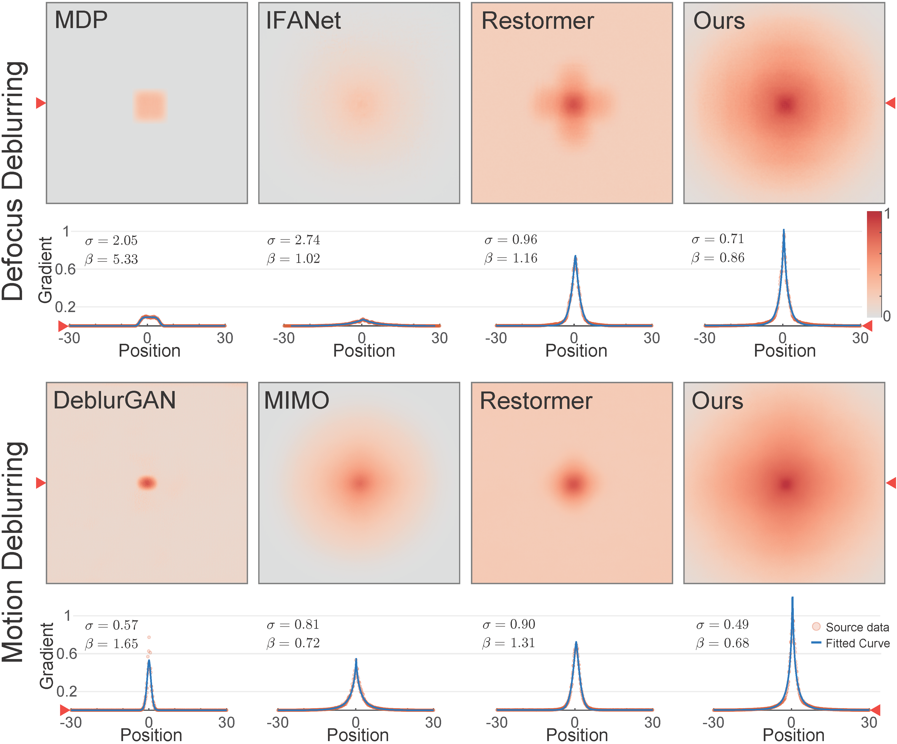
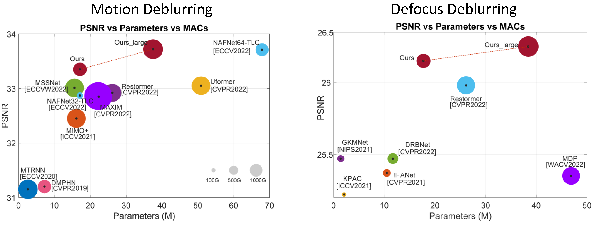

# LaKDNet: Revisiting Image Deblurring with an Efficient ConvNet

  [Lingyan Ruan](http://lyruan.com), [Mojtaba Bemana](https://people.mpi-inf.mpg.de/~mbemana/), [Hans-peter Seidel](https://people.mpi-inf.mpg.de/~hpseidel/), [Karol Myszkowski](https://people.mpi-inf.mpg.de/~karol/), [Bin Chen](https://binchen.me/) 


Max-Planck-Institut fur Informatik  

[](https://paperswithcode.com/sota/image-defocus-deblurring-on-dpd?p=revisiting-image-deblurring-with-an-efficient)

[](https://paperswithcode.com/sota/deblurring-on-hide-trained-on-gopro?p=revisiting-image-deblurring-with-an-efficient)

[](https://paperswithcode.com/sota/deblurring-on-realblur-r-trained-on-gopro?p=revisiting-image-deblurring-with-an-efficient)

[](https://paperswithcode.com/sota/image-defocus-deblurring-on-dpd-dual-view?p=revisiting-image-deblurring-with-an-efficient)

[](https://paperswithcode.com/sota/image-deblurring-on-gopro?p=revisiting-image-deblurring-with-an-efficient)

> **Abstract:** *The recent advancements in Transformers for computer vision tasks have had a notable impact on the field of image restoration. This has led to the development of generic structures, such as Uformer, and Restormer, which have shown superior performance over dedicated task-specific CNNs. The success of these structures can be attributed to their ability to handle long-range interactions, which is believed to be lacking in CNNs. The aim of this paper is to address the limitations of CNN-based structures and enable them to perform image restoration tasks such as motion and defocus deblurring with comparable effectiveness to Transformers. To investigate the factors contributing to restoration performance differences, we analyze the effective receptive field (ERF) of 10 existing methods and propose a metric called ERFMeter to compare ERF across different architectures. Our analysis reveals that the global and local properties of ERF are crucial for achieving superior performance. Based on these findings, we propose a CNN structure called LaKDNet, incorporating a large kernel convolution and mixer shortcuts scheme to enhance the global and local properties of ERF in CNNs. This approach demonstrates higher efficiency than generic Transformer works, as well as existing CNNs with multi-scale-stage strategies. Specifically, we achieve a PSNR improvement of +0.80 dB / +0.67 dB over the state-of-the-art Restormer / Uformer on the GOPRO dataset. Our findings suggest that there are still rooms to improve the performance of CNN when refining the network structure towards an optimal ERF.* 
<hr />

[](https://arxiv.org/abs/2302.02234) [Will update the results with the large model released here.]

```
@misc{ruan2023revisiting,
      title={Revisiting Image Deblurring with an Efficient ConvNet}, 
      author={Lingyan Ruan and Mojtaba Bemana and Hans-peter Seidel and Karol Myszkowski and Bin Chen},
      year={2023},
      eprint={2302.02234},
      archivePrefix={arXiv},
      primaryClass={cs.CV}
}
```

## Effective Receptive Field Analysis 
**Motion & Defocus**

 

## Visual Performance

 

## Performance vs. Computational Cost
 

## Visual Result and Pre-trained Models
Please download the weights and visual result in this [webpage](https://lakdnet.mpi-inf.mpg.de/)


| Task            | Trained Dataset | Evaluated Dataset | PSNR  | SSIM  | #params |
|-----------------|-----------------|-------------------|-------|-------|---------|
| **Motion**      | GoPro           | GoPro             | 33.35 | 0.964 | 17.1M   |
|  **Motion**     |      GoPro            | GoPro             | 33.72 | 0.967 | 37.5M   |
|   **Motion**    |        GoPro          | HIDE              | 31.21 | 0.943 | 17.1M   |
|   **Motion**    |      GoPro            | HIDE              | 31.58 | 0.946 | 37.5M   |
|   **Motion**    |     GoPro             | RealBlur-R        | 35.90 | 0.954 | 17.1M   |
|   **Motion**    |    GoPro              | RealBlur-R        | 36.08 | 0.955 | 37.5M   |
|   **Motion**    |    GoPro              | RealBlur-J        | 28.78 | 0.878 | 17.1M   |
|    **Motion**   |    GoPro              | RealBlur-J        | 28.59 | 0.870 | 37.5M   |
|   **Motion**    | RealBlur-R      | RealBlur-R        | 39.91 | 0.974 | 17.1M   |
|   **Motion**    | RealBlur-R      | RealBlur-R        | 40.25 | 0.975 | 37.5M   |
|   **Motion**    | RealBlur-J      | RealBlur-J        | 32.33 | 0.929 | 17.1M   |
|   **Motion**    | RealBlur-J      | RealBlur-J        | 32.68 | 0.932 | 37.5M   |
| **Defocus-single** | DPDD         | DPDD               | 26.15 | 0.810 | 17.7M   |
|  **Defocus-single** | DPDD            | DPDD               | 26.25 | 0.813 | 38.4M   |
|  **Defocus-single**  | DPDD            | RealDOF            | 25.08 | 0.762 | 17.7M   |
| **Defocus-single**   | DPDD            | RealDOF            | 25.13 | 0.765 | 38.4M   |
| **Defocus-single**   | LFDOF           | LFDOF              | 31.87 | 0.912 | 17.7M   |
|  **Defocus-single**  | LFDOF & DPDD    | DPDD               | 25.89 | 0.792 | 17.7M   |
|  **Defocus-single**  | LFDOF & DPDD    | RealDOF            | 25.83 | 0.769 | 17.7M   |
| **Defocus-dual**   | DPDD         | DPDD               | 26.72 | 0.826 | 17.7M   |
|   **Defocus-dual** | DPDD            | DPDD               | 26.89 | 0.832 | 38.4M   |

note: we increase the channel dimension from 32 to 48 to get the large version.

## Instruction on Evaluation 
note: Training will come later.

### Prerequisites


Notes: the code may also work with other library versions that didn't specify here.

#### 1. Installation

Clone this project to your local machine

```bash
$ git clone https://github.com/lingyanruan/LaKDNet.git
$ cd LaKDNet
```
#### 2. Environment setup

```bash
$ conda create -y --name LaKDNet python=3.8.13 && conda activate LaKDNet
$ sh install_CUDA11.1.1.sh
# Other version will be checked and updated later.
```


#### 3. Pre-trained models

Download and unzip under `./ckpts/` from [webpage](https://lakdnet.mpi-inf.mpg.de/):

#### 4. Datasets download

Download and unzip under `./Test_sets/` from [webpage](https://lakdnet.mpi-inf.mpg.de/):

The original full defocus datasets could be found here: ([LFDOF](https://sweb.cityu.edu.hk/miullam/AIFNET/), [DPDD](https://github.com/Abdullah-Abuolaim/defocus-deblurring-dual-pixel), [CUHK](http://www.cse.cuhk.edu.hk/~leojia/projects/dblurdetect/dataset.html) and [RealDOF](https://www.dropbox.com/s/arox1aixvg67fw5/RealDOF.zip?dl=1)):


The original full motion datasets could be found here: ([GOPRO](https://seungjunnah.github.io/Datasets/gopro), [HIDE](https://github.com/joanshen0508/HA_deblur?tab=readme-ov-file), [REALR&REALJ](http://cg.postech.ac.kr/research/realblur/)).
#### 5. Command Line

```bash
# type could be Motion or Defocus 
# for motion evaluation
$ python run.py --type Motion

# for defocus evaluation
$ python run.py --type Defocus

```

## Contact

Should you have any questions, please open an issue or contact me [lyruanruan@gmail.com](mailto:lyruanruan@gmail.com)

Acknowledgment: Thanks for all the fabulous works included in our comparsions, e.g. Restormer, Uformer, NAFNet.

## License

This software is being made available under the terms in the [LICENSE](LICENSE) file.


