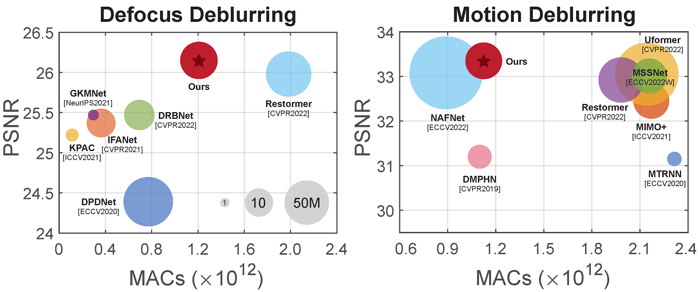
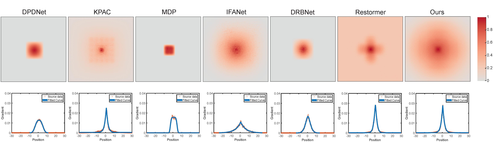
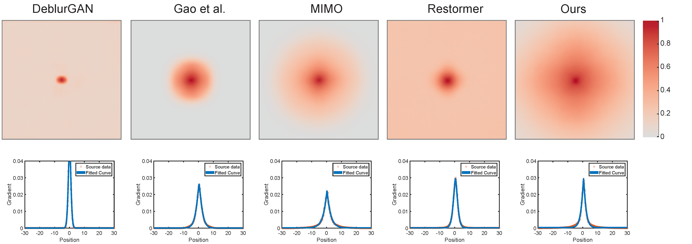

# LaKDNet: Revisiting Image Deblurring with an Efficient ConvNet 

  [Lingyan Ruan](http://lyruan.com), [Mojtaba Bemana](https://people.mpi-inf.mpg.de/~mbemana/), [Hans-peter Seidel](https://people.mpi-inf.mpg.de/~hpseidel/), [Karol Myszkowski](https://people.mpi-inf.mpg.de/~karol/), [Bin Chen](https://binchen.me/) 

Max-Planck-Institut fur Informatik  

> **Abstract:** *Image deblurring aims to recover the latent sharp image from its blurry counterpart and has a wide range of
applications in computer vision. The Convolution Neural Networks (CNNs) have performed well in this domain for many years, and until recently an alternative network architecture, namely Transformer, has demonstrated even stronger performance. One can attribute its superiority to the multi-head self-attention (MHSA) mechanism, which offers a larger receptive field and better input content adaptability than CNNs. However, as MHSA demands high computational costs that grow quadratically with respect to the input resolution, it becomes impractical for high-resolution image deblurring tasks. In this work, we propose a unified lightweight CNN network that features a large effective receptive field (ERF) and demonstrates comparable or even better performance than Transformers while bearing less computational costs. Our key design is an efficient CNN block dubbed LaKD, equipped with a large kernel depth-wise convolution and spatial-channel mixing structure, attaining comparable or larger ERF than Transformers but with a smaller parameter scale. Specifically, we achieve +0.17dB / +0.43dB PSNR over the state-of-theart Restormer on defocus / motion deblurring benchmark datasets with 32% fewer parameters and 39% fewer MACs. Extensive experiments demonstrate the superior performance of our network and the effectiveness of each module. Furthermore, we propose a compact and intuitive ERFMeter metric that quantitatively characterizes ERF, and shows a high correlation to the network performance. We hope this work can inspire the research community to further explore
the pros and cons of CNN and Transformer architectures beyond image deblurring tasks.* 

 [Come soon!]

## Performance vs. Computational Cost
 

## Effective Receptive Field Analysis 
**Defocus**

 

**Motion**
 

## Will update soon!
## Quick Demo

## Instruction on the Training and Evaluation

## Visual Result and Pre-trained Models

## Quantitive Result
